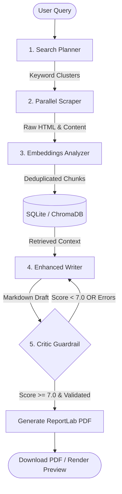

# 🚀 Autonomous Scientific Research Platform

A production-grade, local-first scientific research portal that autonomously transforms raw user queries into structured, fully sourced professional PDF reports. 

This platform orchestrates a **five-agent cognitive pipeline** that handles task planning, web scraping, data chunking, semantic vector indexing, retrieval-augmented drafting, and factual checking with a self-corrective revision loop.

---

## 🧠 System Architecture Overview



1. **Planner**: Optimizes queries into technical keyword search clusters.
2. **Scraper**: Performs parallel, headless web data acquisition, removing boilerplates and paywalls.
3. **Analyzer**: Deduplicates content, generates embeddings via **Nomic**, and stores them in a local **ChromaDB** vector store and SQLite cache.
4. **Writer**: Employs Retrieval-Augmented Generation (RAG) to draft structured chapters and insert comparison tables.
5. **Critic**: Evaluates reports against source contexts to prevent hallucinations, scoring accuracy out of 10. Failed drafts route back to the Writer with specific revision feedback.

---

## 🛠️ Prerequisites

Before you start, make sure you have the following installed on your system:
- **Node.js 18+** (for the React/Vite Frontend)
- **Python 3.11+** (for the FastAPI Backend & Agents)
- **Ollama** (for local LLM inference and embeddings)
- **Docker & Docker Compose** (Optional, for running containerized services)

---

## 🚀 Getting Started

### 1. Ollama Configuration (Local Models)
Start your local Ollama instance and run:
```bash
ollama pull llama3.1:8b-instruct-q4_K_M
ollama pull nomic-embed-text
```

### 2. Backend Setup
1. Open a terminal and navigate to the project directory:
   ```bash
   cd Research-system-backend
   ```
2. Create and activate a Python virtual environment:
   - **Windows:** `python -m venv venv` and `venv\Scripts\activate`
   - **Mac/Linux:** `python -m venv venv` and `source venv/bin/activate`
3. Install required packages:
   ```bash
   pip install -r requirements.txt
   ```
4. Create a `.env` file in the root directory and add your OpenRouter key:
   ```env
   OPENROUTER_API_KEY="your_openrouter_api_key_here"
   ```
5. Launch the FastAPI server:
   ```bash
   python main.py
   ```
   The backend will start on: `http://localhost:8679`

### 3. Frontend Setup
1. In a new terminal window, navigate to the project directory.
2. Install npm dependencies:
   ```bash
   npm install
   ```
3. Start the Vite React development server:
   ```bash
   npm run dev
   ```
   The web portal will open on: `http://localhost:3000`

---

## 🐳 Production Deployment (Docker Compose)

The system includes a pre-configured `docker-compose.yml` to package both the React application (serving compiled assets) and the FastAPI backend with GPU-accelerated Ollama:

1. Build and run containers in detached mode:
   ```bash
   docker compose up -d --build
   ```
2. Pull the necessary models inside the Ollama container:
   ```bash
   docker exec -it research_ollama ollama pull llama3.1:8b-instruct-q4_K_M
   docker exec -it research_ollama ollama pull nomic-embed-text
   ```
3. Access the portal gateway at: `http://localhost:8679`

---

## 📡 API Reference Schema

- **GET `/api/stats`**: Returns summary database metrics (Total Pages Scraped, Indexed Chunks, Average Length).
- **POST `/api/research`**: Starts the execution flow for a query. Body parameters:
  ```json
  {
    "query": "Solid-state battery dendrite prevention",
    "research_type": "deep",
    "detail_level": "comprehensive"
  }
  ```
- **GET `/api/history`**: Returns previous search reports, citation logs, and document references.
- **GET `/api/pdf/{filename}`**: Streams the generated PDF report layout.
