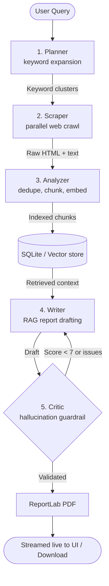

# Autonomous Research Platform

A production-grade, multi-agent research system that turns a plain-language question into a fully sourced, publication-ready **PDF report** — automatically.

Five specialized agents collaborate in a pipeline with a self-corrective revision loop:



## Highlights

- **Pluggable LLM providers** — works with an API key (OpenRouter, Groq, OpenAI, Gemini) *or* fully local (Ollama). Auto-fallback picks whichever is available; no code changes needed.
- **Real-time progress** — the pipeline streams every agent stage over Server-Sent Events; the UI shows live status per stage.
- **Self-correcting quality loop** — the Critic scores drafts for hallucinations/contradictions and routes them back to the Writer with actionable feedback (up to `MAX_REVISION_LOOPS`).
- **Graceful degradation everywhere** — no ChromaDB? An in-process vector store is used. No Ollama embeddings? Deterministic hashing embeddings kick in. No LLM key? The health endpoint tells you exactly what to configure.
- **Clean layered architecture** — `api → services → agents/tools`, one SQLite schema, typed Pydantic contracts, 36 passing backend tests.

---

## Project Structure

```
├── backend/                  # FastAPI + Python agents
│   ├── app/
│   │   ├── api/              # HTTP routes & Pydantic schemas
│   │   ├── agents/           # planner, scraper, analyzer, writer, critic
│   │   ├── core/             # config (.env), database (SQLite), logging
│   │   ├── services/
│   │   │   ├── llm/          # provider abstraction: OpenRouter/Groq/OpenAI/Gemini/Ollama
│   │   │   ├── embeddings.py # Ollama embeddings w/ hashing fallback
│   │   │   ├── pipeline.py   # 5-agent orchestrator + event streaming
│   │   │   ├── pdf.py        # ReportLab rendering + text sanitization
│   │   │   └── reports.py    # history persistence
│   │   ├── tools/            # DuckDuckGo search, async httpx scraper
│   │   ├── vectorstore/      # optional ChromaDB / in-memory fallback
│   │   └── main.py           # FastAPI app factory
│   └── tests/                # pytest suite
├── frontend/                 # React 19 + Vite + Tailwind v4
│   └── src/
│       ├── lib/api.ts        # single API client (SSE streaming + fallback)
│       └── components/       # workspace, pipeline tracker, stats, history
└── docker-compose.yml
```

## Prerequisites

- **Python 3.11+**
- **Node.js 18+**
- One of:
  - any hosted LLM API key (OpenRouter / Groq / OpenAI / Gemini), **or**
  - [Ollama](https://ollama.com) for local inference

## Quick Start

### 1. Backend

```bash
cd backend
python -m venv venv
# Windows: venv\Scripts\activate    |    macOS/Linux: source venv/bin/activate
pip install -r requirements.txt

copy .env.example .env              # then add at least one API key
uvicorn app.main:app --port 8679 --reload
```

Minimal `.env` examples (any **one** is enough):

```env
LLM_PROVIDER=auto
OPENROUTER_API_KEY=sk-or-v1-...     # free models available
```
```env
LLM_PROVIDER=auto
GROQ_API_KEY=gsk_...
```

Local-only setup (no keys): install Ollama, then:

```bash
ollama pull llama3.1:8b-instruct-q4_K_M
ollama pull nomic-embed-text
```

The registry resolves providers in order: `openrouter → groq → openai → gemini → ollama`.
Check what's active: `GET http://localhost:8679/api/health`.

### 2. Frontend

```bash
cd frontend
npm install
npm run dev
```

Open **http://localhost:3000**. The dev server proxies `/api/*` to the backend, so there are no CORS issues.

The header shows the connection state. If the backend is offline, the portal runs in **demo mode** so you can still explore the full UI.

### 3. Production build (unified mode)

```bash
cd frontend && npm run build
cd ../backend && uvicorn app.main:app --port 8679
# FastAPI now serves both the app and the API at http://localhost:8679
```

### Docker

```bash
docker compose up -d --build                    # backend + frontend
docker compose --profile ollama up -d           # + local Ollama container
```

---

## API Reference

| Method | Endpoint | Description |
| --- | --- | --- |
| `GET` | `/api/health` | Service status + configured/active LLM providers |
| `POST` | `/api/research` | Run the full pipeline, return final result |
| `POST` | `/api/research/stream` | Same, but streams SSE stage events |
| `GET` | `/api/stats` | Indexed pages/chunks statistics |
| `GET` | `/api/history` | Past reports |
| `DELETE` | `/api/history/{id}` | Delete a report record |
| `GET` | `/api/pdf/{filename}` | Stream a generated PDF |

Example:

```bash
curl -X POST http://localhost:8679/api/research \
  -H "Content-Type: application/json" \
  -d '{"query": "solid-state battery dendrite prevention", "research_type": "deep", "detail_level": "comprehensive"}'
```

Streaming events look like:

```
data: {"type": "stage", "stage": "Scraper", "status": "running", "output": "..."}
data: {"type": "result", "status": "success", "report": "# ...", "pdf": "report_x.pdf"}
data: [DONE]
```

Interactive docs: **http://localhost:8679/docs**

## Testing

```bash
cd backend
pytest tests -v
```

## Configuration Reference (`backend/.env`)

| Variable | Default | Purpose |
| --- | --- | --- |
| `LLM_PROVIDER` | `auto` | Force `openrouter` / `groq` / `openai` / `gemini` / `ollama` |
| `OPENROUTER_API_KEY` etc. | – | Hosted provider credentials |
| `OLLAMA_BASE_URL` | `http://localhost:11434` | Local Ollama daemon |
| `MAX_REVISION_LOOPS` | `3` | Max Writer↔Critic iterations |
| `CRITIC_PASS_SCORE` | `7.0` | Minimum critic score to accept a draft |
| `PORT` | `8679` | Backend port |

## License

MIT
