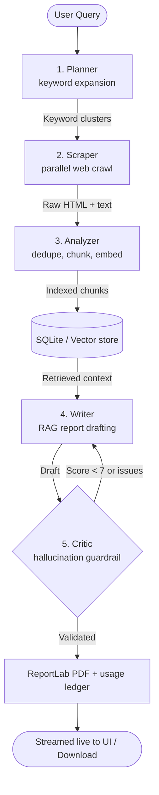

# Autonomous Research Platform

A production-grade, multi-agent research system that turns a plain-language question into a fully sourced, publication-ready **PDF report** — automatically, with live progress streaming and per-run **cost accounting**.

Five specialized agents collaborate in a pipeline with a self-corrective revision loop:



## Highlights

### Two paths to intelligence — pick either (or both)

| | API path | Local path |
|---|---|---|
| Providers | OpenRouter · Groq · OpenAI · Gemini | Ollama |
| Setup | paste an API key in `.env` | install Ollama + pull models |
| Cost | metered per token (**tracked & estimated automatically**) | $0 |
| Privacy | requests leave your machine | 100% offline |

**Multi-provider handling** is built in:
- **Auto-fallback resolution** — no key? falls to the next provider; Ollama down? same.
- **Runtime failover** — if the routed provider errors mid-request after retries, the next configured provider serves the call transparently.
- **Per-stage routing** — run each agent on a different brain, e.g. draft with `gpt-4o-mini`, critique with free local Llama:

  ```env
  LLM_PROVIDER=auto
  WRITER_PROVIDER=openai      # strong writer
  CRITIC_PROVIDER=ollama      # free critic
  PLANNER_PROVIDER=groq       # fast planner
  ```

### Cost calculation

Every LLM call is recorded into a usage ledger with token counts, latency and an **estimated USD cost** from a built-in price catalog (33+ models, extensible via `PRICE_OVERRIDES_JSON`). Free tiers (`:free`) and local Ollama models are counted at $0.

- `GET /api/usage` → totals, spend by provider/model, spend by pipeline stage, recent calls
- Every research response embeds its own `usage` summary; the UI renders it in a cost panel
- Unknown model pricing? Tokens are still tracked; cost shows as null instead of lying

### More domain features

- **Real-time progress** — every agent stage streams over Server-Sent Events, including Writer↔Critic revision iterations.
- **Self-correcting quality loop** — the Critic scores drafts for hallucinations/contradictions and re-routes them to the Writer with actionable feedback (persisted per report).
- **Source citations** — each report carries the crawled source URLs it was grounded in, shown collapsibly under the markdown pane.
- **Report replay from history** — stored reports reload in full from the backend, not just metadata.
- **Graceful degradation everywhere** — no ChromaDB → in-process vector store; no embedding model → hashing embeddings; no LLM → precise health message telling you what to configure.
- **Clean layered architecture** — `api → services → agents/tools`, typed Pydantic contracts, 50 passing backend tests.

---

## Project Structure

```
├── backend/                  # FastAPI + Python agents
│   ├── app/
│   │   ├── api/              # HTTP routes & Pydantic schemas
│   │   ├── agents/           # planner, scraper, analyzer, writer, critic
│   │   ├── core/             # config (.env), SQLite schema+migrations, logging
│   │   ├── services/
│   │   │   ├── llm/          # provider abstraction: OpenRouter/Groq/OpenAI/Gemini/Ollama
│   │   │   │                 #   + failover orchestration + per-stage routing
│   │   │   ├── pricing.py    # model price catalog -> cost estimation
│   │   │   ├── usage.py      # usage ledger persistence + aggregation
│   │   │   ├── embeddings.py # Ollama embeddings w/ hashing fallback
│   │   │   ├── pipeline.py   # 5-agent orchestrator + event streaming
│   │   │   ├── pdf.py        # ReportLab rendering + text sanitization
│   │   │   └── reports.py    # history persistence
│   │   ├── tools/            # DuckDuckGo search, async httpx scraper
│   │   ├── vectorstore/      # optional ChromaDB / in-memory fallback
│   │   └── main.py           # FastAPI app factory
│   └── tests/                # pytest suite (sanitizer, planner, llm, pricing, usage, db)
├── frontend/                 # React 19 + Vite + Tailwind v4
│   └── src/
│       ├── lib/api.ts        # single API client (SSE streaming + fallback)
│       └── components/       # workspace, pipeline tracker, usage panel, stats, history
└── docker-compose.yml
```

## Prerequisites

- **Python 3.11+**
- **Node.js 18+**
- One of:
  - any hosted LLM API key (OpenRouter / Groq / OpenAI / Gemini), **or**
  - [Ollama](https://ollama.com) for local inference

## Quick Start

### 1. Backend

```bash
cd backend
python -m venv venv
# Windows: venv\Scripts\activate    |    macOS/Linux: source venv/bin/activate
pip install -r requirements.txt

copy .env.example .env              # then add at least one API key
uvicorn app.main:app --port 8679 --reload
```

Minimal `.env` examples (any **one** is enough):

```env
LLM_PROVIDER=auto
OPENROUTER_API_KEY=sk-or-v1-...     # free models available
```
```env
LLM_PROVIDER=auto
GROQ_API_KEY=gsk_...
```

Local-only setup (no keys): install Ollama, then:

```bash
ollama pull llama3.1:8b-instruct-q4_K_M
ollama pull nomic-embed-text
```

The registry resolves providers in order: `openrouter → groq → openai → gemini → ollama`,
with optional per-stage overrides (`WRITER_PROVIDER`, `CRITIC_PROVIDER`, `PLANNER_PROVIDER`).
Check what's active: `GET http://localhost:8679/api/health`.

### 2. Frontend

```bash
cd frontend
npm install
npm run dev
```

Open **http://localhost:3000**. The dev server proxies `/api/*` to the backend, so there are no CORS issues.

The header shows the connection state. If the backend is offline, the portal runs in **demo mode** so you can still explore the full UI.

### 3. Production build (unified mode)

```bash
cd frontend && npm run build
cd ../backend && uvicorn app.main:app --port 8679
# FastAPI now serves both the app and the API at http://localhost:8679
```

### Docker

```bash
docker compose up -d --build                    # backend + frontend
docker compose --profile ollama up -d           # + local Ollama container
```

---

## API Reference

| Method | Endpoint | Description |
| --- | --- | --- |
| `GET` | `/api/health` | Service status + configured/active LLM providers (+ stage routes) |
| `POST` | `/api/research` | Run the full pipeline, return final result incl. `usage` + `sources` |
| `POST` | `/api/research/stream` | Same, but streams SSE stage events |
| `GET` | `/api/stats` | Indexed pages/chunks statistics |
| `GET` | `/api/history` | Past reports (incl. persisted critic scores) |
| `GET` | `/api/history/{id}` | Full stored report (markdown replay) |
| `DELETE` | `/api/history/{id}` | Delete a report record |
| `GET` | `/api/pdf/{filename}` | Stream a generated PDF |
| `GET` | `/api/usage` | Token/cost aggregates: totals, by provider, by stage, recent calls |
| `GET` | `/api/pricing` | Known-model price catalog (USD / 1M tokens) |

Example:

```bash
curl -X POST http://localhost:8679/api/research \
  -H "Content-Type: application/json" \
  -d '{"query": "solid-state battery dendrite prevention", "research_type": "deep", "detail_level": "comprehensive"}'
```

Every response carries its own economics:

```json
{
  "status": "success",
  "report_id": 12,
  "critic_score": 8.6,
  "usage": {
    "calls": 4,
    "total_tokens": 48210,
    "estimated_cost_usd": 0.0312,
    "per_provider": [{"provider": "groq", "model": "llama-3.3-70b-versatile", "calls": 3, "cost_usd": 0.0312}]
  },
  "sources": [{"url": "https://arxiv.org/abs/...", "title": "..."}]
}
```

Streaming events look like:

```
data: {"type": "stage", "stage": "Scraper", "status": "running", "output": "..."}
data: {"type": "result", "status": "success", "report": "# ...", "usage": {...}}
data: [DONE]
```

Interactive docs: **http://localhost:8679/docs**

## Testing

```bash
cd backend
pytest tests -v        # 50 tests, fully offline
```

## Configuration Reference (`backend/.env`)

| Variable | Default | Purpose |
| --- | --- | --- |
| `LLM_PROVIDER` | `auto` | Force `openrouter` / `groq` / `openai` / `gemini` / `ollama` |
| `PLANNER_PROVIDER` / `WRITER_PROVIDER` / `CRITIC_PROVIDER` | – | Per-stage routing overrides |
| `OPENROUTER_API_KEY` etc. | – | Hosted provider credentials |
| `PRICE_OVERRIDES_JSON` | – | JSON map of custom model prices (USD / 1M tokens) |
| `OLLAMA_BASE_URL` | `http://localhost:11434` | Local Ollama daemon |
| `MAX_REVISION_LOOPS` | `3` | Max Writer↔Critic iterations |
| `CRITIC_PASS_SCORE` | `7.0` | Minimum critic score to accept a draft |
| `PORT` | `8679` | Backend port |

## License

MIT
